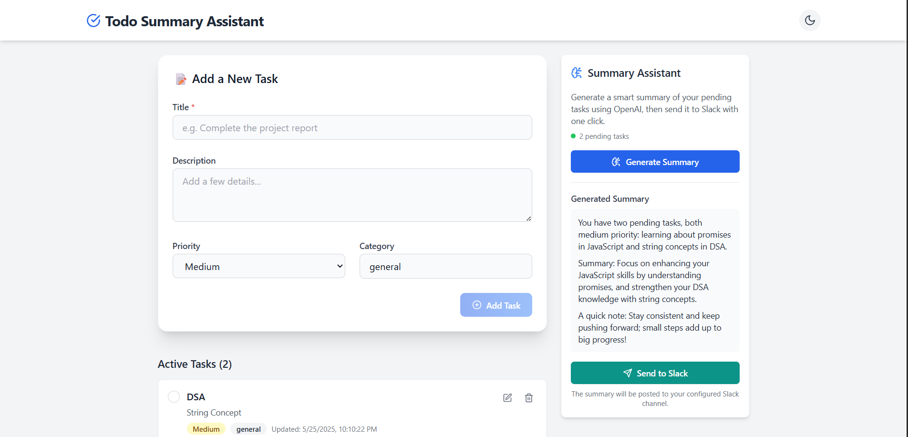
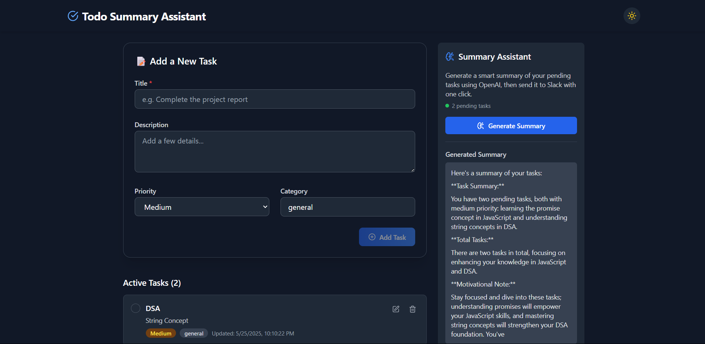
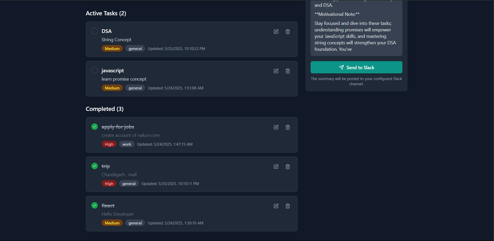

#  Todo Summary Assistant

A full-stack productivity app that helps users manage tasks with enhanced features like AI-powered summary generation using Cohere and Slack integration for sharing daily summaries.


---


---



##  Features

- Create, update, delete, and complete tasks.
- Assign priority and category to each task.
- Generate concise summaries of pending tasks using Cohere's LLM.
- Send task summaries to a Slack channel with one click.
- Fully responsive dark/light UI toggle.


## Tech Stack

- **Frontend**: React, TypeScript, Tailwind CSS, Lucide Icons
- **Backend**: Node.js, Express.js
- **Database**: MongoDB (Mongoose ODM)
- **AI Integration**: Cohere API
- **Communication**: Slack Webhook


## 📦 Installation

### 1. Clone the Repository

```bash
git clone https://github.com/your-username/todo-summary-assistant.git
cd todo-summary-assistant
```

### 2. Install Dependencies

```bash
npm install
```


## Setup Instructions

### 1. Environment Variables

Create a `.env` file in the `root` folder:

```env
PORT=3005
MONGODB_URI=mongodb://localhost:27017/todo_summary
COHERE_API_KEY=your_cohere_api_key
SLACK_WEBHOOK_URL=https://hooks.slack.com/services/your/slack/webhook
```

##  Slack Integration Setup

- Navigate to your Slack workspace and [create a new Incoming Webhook](https://api.slack.com/messaging/webhooks).
- Set the destination channel (e.g., `#daily-summary`).
- Copy the webhook URL and paste it into your `.env` under `SLACK_WEBHOOK_URL`.


##  LLM Integration with Cohere

- [Sign up at Cohere](https://cohere.ai) and generate an API key.
- Place the key in your `.env` file as `COHERE_API_KEY`.

The app uses `command-r-plus` to generate concise summaries.


## 🧱 Design and Architecture Decisions

### Component Architecture

| Component       | Purpose                                             |
|----------------|-----------------------------------------------------|
| `Header.tsx`    | Contains branding and dark/light mode toggle       |
| `Footer.tsx`    | Simple footer branding                             |
| `TodoForm.tsx`  | Adds new tasks with form validation and states     |
| `TodoItem.tsx`  | Renders individual todo items with edit/delete     |
| `TodoList.tsx`  | Displays todos grouped by status                   |
| `SummaryPanel.tsx` | Generates AI summaries and sends them to Slack |

### Backend API Structure

| Route              | Description                                  |
|-------------------|----------------------------------------------|
| `/api/todos`       | CRUD operations for todos                   |
| `/api/summary`     | Generates summary using Cohere              |
| `/api/slack`       | Sends summary to Slack using webhook        |

### Design Choices

- **Priority-based sorting**: High-priority tasks appear first in summaries.
- **Real-time UI updates**: After every CRUD operation, UI refreshes instantly.
- **Modular backend**: API routes separated by domain (todos, summary, slack).
- **Accessibility**: Semantic HTML, proper labels, and color contrasts.


## Future Improvements

- Authentication & user-specific task lists
- Email notifications
- Integration with other chat apps (e.g., MS Teams, Discord)
- Natural language task entry


## 🧑‍💻 Author

**Bhakti Agrawal**  
GitHub: [bhaktiagrawal088](https://github.com/bhaktiagrawal088)  
Email: bhaktiagrawal286@gmail.com
